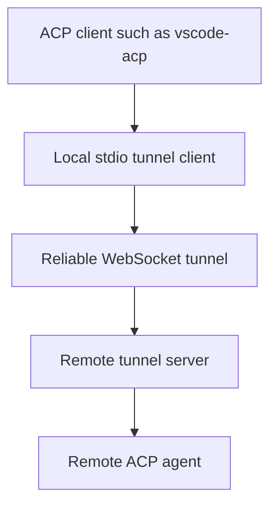

# acp-reliable-tunnel

Reliable, reconnectable ACP tunnel over WebSocket that preserves ACP wire semantics and lets local ACP clients reach remote agents securely.

## What This Is

`acp-reliable-tunnel` is a transport bridge for Agent Client Protocol (ACP) workloads, not a new protocol and not a Claude-specific agent.

It allows an ACP client such as `vscode-acp` to keep talking to a local subprocess over stdio, while that subprocess forwards raw ACP JSON-RPC messages to a remote ACP agent over a reliable WebSocket tunnel.

This repository adds transport reliability, reconnect, replay, authentication, and remote agent hosting without changing ACP itself.

## What This Is Not

- not a fork of ACP
- not a new ACP transport spec
- not Claude-specific, even though `claude-agent-acp` is a primary integration target
- not a shared multi-tenant ACP broker

## Why It Exists

ACP is intentionally transport-agnostic. That is useful, but editor integrations such as `vscode-acp` often assume a local stdio subprocess.

This project preserves that local subprocess contract while moving the real agent runtime to another machine.

That gives you:

- remote agent execution
- reconnect after transient network loss
- ordered delivery with replay
- shared-secret or JWT authentication
- optional TLS and mTLS-ready deployment
- compatibility with existing ACP clients and agents

## Architecture



ACP messages remain unchanged. They are carried inside reliable tunnel frames.

## Core Features

- local stdio shim for ACP-compatible clients
- reliable ordered delivery with cumulative ACKs
- reconnect and replay of unacknowledged messages
- remote ACP agent subprocess hosting
- tunnel ownership binding to authenticated identity
- shared-secret and JWT auth
- TLS and mTLS-ready transport configuration
- loopback and production configuration examples

## Repositories In The Full Solution

- `agent-client-protocol`: protocol source of truth, unchanged for this feature
- `vscode-acp`: editor integration and remote tunnel discovery
- `claude-agent-acp`: remote ACP agent with cwd and session ownership enforcement
- `acp-reliable-tunnel`: reliable transport bridge implemented in this repository

## How It Works

1. The ACP client launches a local subprocess.
2. That subprocess is the stdio tunnel client from this repo.
3. The client sends a `hello` frame and authenticates.
4. The server replies with `welcome` and either creates or reattaches a tunnel session.
5. Raw ACP JSON-RPC payloads flow inside reliable tunnel frames.
6. If the socket drops, the client reconnects with the same tunnel ID and replays anything not yet acknowledged.

## Typical Use Cases

- running `vscode-acp` against a remote coding agent
- keeping Claude or other ACP agents on a more powerful remote machine
- securing ACP traffic over internet-facing or semi-trusted networks
- preserving local editor file and terminal capabilities while moving agent execution remote

## Status

Current scope includes:

- dedicated tunnel per ACP client
- reconnect with replay and duplicate suppression
- remote agent subprocess hosting
- loopback and production configs
- JWT and shared-secret auth
- TLS and mTLS-ready transport support

Not in scope:

- changing ACP method semantics
- multi-client multiplexing onto one shared ACP session
- disk-backed replay persistence across tunnel server restarts

## Quick Start

### Run the server

```bash
npm run start:server -- --config ./configs/server.example.json
```

### Run the local stdio client

```bash
node ./dist/bin/stdio-client.js --config ./configs/client.example.json
```

### Use with vscode-acp

Configure `vscode-acp` to launch the local stdio client from this repository as the ACP subprocess for the remote-tunnel agent entry.

## Security

Production deployments should prefer:

- `wss://`
- JWT auth
- restricted scopes
- short reconnect windows
- optional mTLS
- remote agent cwd restrictions
