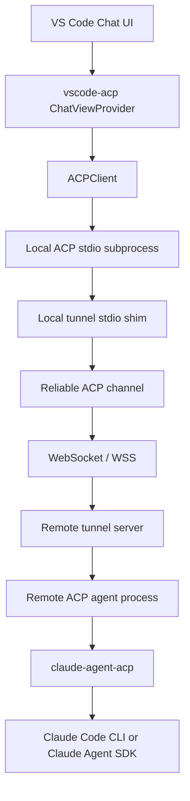
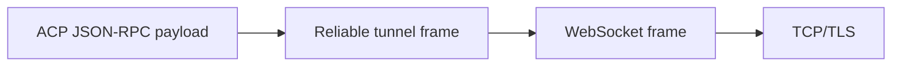
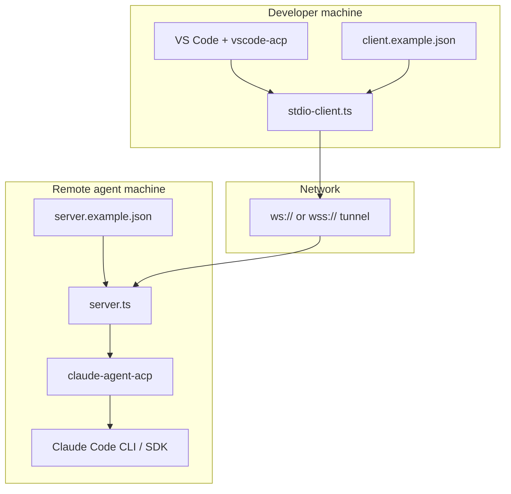
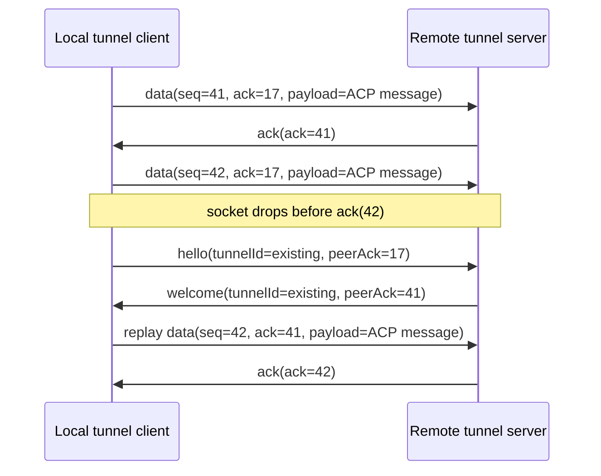
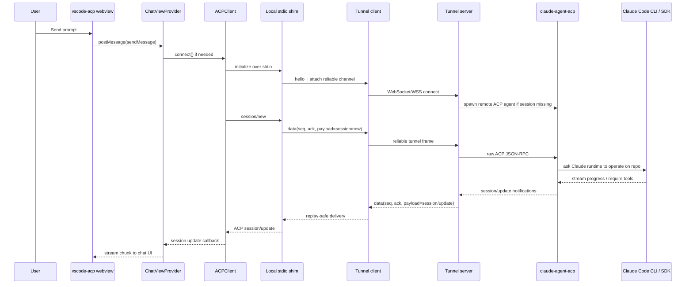

# Cross-Internet ACP Tunnel Tutorial

## Purpose

This document is the single release-note-style technical tutorial for the cross-repo work completed across these repositories:

- `C:\Playground\agent-client-protocol`
- `C:\Playground\vscode-acp`
- `C:\Playground\claude-agent-acp`
- `C:\Playground\acp-reliable-tunnel`

It explains:

- what we started from
- what constraints already existed
- why ACP itself was not changed on the wire
- how the new reliable tunnel works
- how `vscode-acp` is integrated without breaking its local subprocess model
- how the tunnel server hosts `claude-agent-acp`
- how `claude-agent-acp` then delegates into Claude Code CLI or Claude Agent SDK
- what realistic request and response payloads look like across the stack
- how reconnect, replay, ownership, and transport security behave in practice

The target reader is an engineer who wants to understand or operate the full path from the VS Code chat prompt to a remote coding agent running across the public internet.

## Executive Summary

The key architectural decision was to preserve ACP as a transport-agnostic JSON-RPC protocol and add a reliable reconnectable transport layer beneath it.

We did **not** fork ACP and we did **not** add WebSocket semantics to ACP messages themselves. Instead:

1. `vscode-acp` still spawns an ACP-compatible subprocess locally.
2. That subprocess is the local stdio shim from this repository.
3. The stdio shim opens a reliable authenticated WebSocket tunnel.
4. The remote tunnel server keeps a session-bound remote ACP agent process alive.
5. That remote ACP agent process is typically `claude-agent-acp`.
6. `claude-agent-acp` continues to drive Claude Code CLI or the Claude Agent SDK exactly as it already did.

That choice gives us internet connectivity, reconnect, replay, shared-secret or JWT authentication, optional TLS and mTLS, and session ownership guarantees, while keeping ACP-compatible clients and agents largely unchanged.

For a shorter non-implementation summary, see `docs/release-notes-cross-repo-summary.md`.

## Repository Change Matrix

The table below answers the direct question of which repositories actually needed changes for this feature set.

| Repository | Needed changes? | Why |
| --- | --- | --- |
| `agent-client-protocol` | No functional changes | ACP already had the correct transport-agnostic contract. The design goal was to preserve ACP wire semantics and add the reliable transport below ACP instead. |
| `vscode-acp` | Yes | The editor had to discover and launch a tunnel-backed local shim, refresh agent inventory, expose a provider API, and track multiple sessions in the UI. |
| `claude-agent-acp` | Yes | The remote ACP agent needed stronger cwd normalization, allowed-root enforcement, and resume/load ownership checks so remote sessions could not be resumed from the wrong working tree. |
| `acp-reliable-tunnel` | Yes | This repository is the new transport layer: stdio shim, reliable replay and ACK channel, authenticated handshake, reconnect window, and remote agent hosting. |

## Repo-By-Repo Why

### `agent-client-protocol`: No functional changes required

This repository did not need protocol work because the solution deliberately avoided ACP wire changes.

What mattered here was the existing ACP property set:

- JSON-RPC payloads were already transport-agnostic.
- ACP clients and agents already communicated through abstract connections rather than a WebSocket-specific contract.
- No new ACP methods were required just to move the transport off-machine.

In practice, the only related change in that repo was the workspace convenience commit, not a protocol, schema, or library change.

### `vscode-acp`: Changes required

`vscode-acp` needed changes because the editor experience had to remain local while the actual agent runtime moved remote.

That required:

- built-in remote tunnel agent discovery
- provider registration and override behavior
- refreshable agent inventory
- multi-session handling in the UI and client state
- extension API exposure for external providers

### `claude-agent-acp`: Changes required

`claude-agent-acp` needed changes because remote reconnectable sessions create a stronger need for path ownership and session ownership checks.

That required:

- cwd normalization to absolute paths
- allowed-root filtering
- verifying that resumed or loaded sessions belong to the same normalized cwd
- test coverage for rejected resume/load cases

### `acp-reliable-tunnel`: Changes required

This repository is where the cross-internet transport work actually lives.

That required:

- handshake frames such as `hello` and `welcome`
- reliable replay using `seq`, cumulative `ack`, and outbox retention
- local stdio-to-WebSocket bridging
- remote agent process hosting
- tunnel authentication and ownership binding
- reconnect windows and agent retention
- TLS and mTLS-ready transport configuration

## Exact Code Touch Points

This section lists the concrete source files and entry points that make the cross-repo design real.

### `agent-client-protocol`

No feature-bearing source changes were required in this repository for the tunnel architecture.

### `vscode-acp`

Primary files:

- `C:\Playground\vscode-acp\src\acp\agents.ts`
- `C:\Playground\vscode-acp\src\extension.ts`

Key entry points:

- `registerAgentProvider(provider: AgentProvider)` in `src/acp/agents.ts`
- `unregisterAgentProvider(providerId: string)` in `src/acp/agents.ts`
- remote tunnel agent resolution logic in `src/acp/agents.ts` that returns `claude-remote-tunnel` with `stdio-client.js --config ...`
- exported extension API method `registerAgentProvider(provider)` in `src/extension.ts`
- exported extension API method `refreshAgents()` in `src/extension.ts`

Why these matter:

- they let the editor discover a tunnel-backed ACP subprocess without changing the editor-to-agent stdio contract
- they enable provider-based extension and refresh behavior rather than a hard-coded fixed agent list

### `claude-agent-acp`

Primary files:

- `C:\Playground\claude-agent-acp\src\acp-agent.ts`
- `C:\Playground\claude-agent-acp\src\tools.ts`
- `C:\Playground\claude-agent-acp\src\tests\session-cwd-policy.test.ts`

Key entry points:

- `getAllowedSessionRoots(...)` in `src/acp-agent.ts`
- `normalizeSessionCwd(cwd: string)` in `src/acp-agent.ts`
- `assertSessionAccessibleFromCwd(sessionId: string, cwd: string)` in `src/acp-agent.ts`
- `unstable_resumeSession(params: ResumeSessionRequest)` in `src/acp-agent.ts`
- `loadSession(params: LoadSessionRequest)` in `src/acp-agent.ts`
- `unstable_forkSession(params: ForkSessionRequest)` now using normalized cwd in `src/acp-agent.ts`

Why these matter:

- they prevent session reuse across different project roots
- they turn cwd from a soft hint into a verified ownership boundary for remote session continuation

### `acp-reliable-tunnel`

Primary files:

- `C:\Playground\acp-reliable-tunnel\src\reliable\types.ts`
- `C:\Playground\acp-reliable-tunnel\src\tunnel\auth.ts`
- `C:\Playground\acp-reliable-tunnel\src\tunnel\client-connection.ts`
- `C:\Playground\acp-reliable-tunnel\src\tunnel\server.ts`

Key entry points:

- `HelloFrame`, `WelcomeFrame`, `DataFrame`, `AckFrame`, and `CloseFrame` in `src/reliable/types.ts`
- `verifySharedSecret(...)` in `src/tunnel/auth.ts`
- `verifyJwt(...)` in `src/tunnel/auth.ts`
- `connect()` in `src/tunnel/client-connection.ts`
- `scheduleReconnect()` in `src/tunnel/client-connection.ts`
- `handleSocket(socket: WebSocket)` in `src/tunnel/server.ts`
- `getOrCreateSession(tunnelId, identity)` in `src/tunnel/server.ts`
- `waitForHello(socket)` in `src/tunnel/server.ts`

Why these matter:

- they are the actual handshake, authentication, ownership, reconnect, replay, and remote agent lifecycle implementation
- they form the transport substrate that keeps ACP messages unchanged while still working across the internet

## Starting Point

### Repository Baseline

#### `agent-client-protocol`

This is the protocol source of truth.

What we already had:

- ACP request, response, and notification shapes
- ACP method naming and JSON-RPC framing
- ACP client and agent side connection abstractions
- transport-agnostic protocol semantics

Important design fact:

- ACP intentionally does not care whether bytes travel over stdio, pipes, sockets, or WebSocket.

That means the correct way to add cross-internet connectivity is not to mutate ACP semantics. The correct way is to supply a new transport implementation that faithfully carries ACP payloads.

#### `vscode-acp`

This extension already assumed a local ACP agent subprocess.

What we already had:

- a chat view and webview UI
- an `ACPClient` that launches a local process and communicates over stdin and stdout
- support for ACP session creation and prompt exchange
- file system and terminal client capabilities available to the agent through ACP

Constraint that mattered most:

- `vscode-acp` expects to spawn a subprocess and talk ACP over stdio.

That constraint is why the local stdio shim exists.

#### `claude-agent-acp`

This repo already exposed Claude as an ACP-compatible agent.

What we already had:

- ACP-facing agent implementation
- session creation and session loading
- model and mode management
- delegation into Claude tooling

What we extended:

- cwd normalization and absolute-path enforcement
- allowed-root policy for new and resumed sessions
- session ownership checks so a session from one working tree cannot be resumed from another working tree

#### `acp-reliable-tunnel`

This repository did not exist as a production-quality transport before the work.

What we introduced here:

- a reconnectable ACP-over-WebSocket tunnel
- reliable ordered replay using sequence numbers and cumulative ACKs
- a local stdio client that acts like an ACP subprocess to the editor
- a remote server that hosts ACP agent subprocesses
- shared-secret and JWT authentication
- transport TLS and mTLS-ready configuration
- loopback and production configuration examples
- unit and integration coverage for reconnect and multi-client behavior

### External Dependencies and Runtimes

At a system level, the combined solution depends on these layers:

- VS Code and the `vscode-acp` extension
- Node.js for `vscode-acp` and the tunnel components
- `@agentclientprotocol/sdk` for ACP side connections and message types
- `ws` for WebSocket transport
- `jose` for JWT verification and JWKS integration
- the Claude runtime behind `claude-agent-acp`, typically Claude Code CLI or Claude Agent SDK

## What We Wanted To Introduce

We wanted all of the following simultaneously:

1. Use `vscode-acp` as-is from the editor user's point of view.
2. Reach an ACP agent running on another machine over the internet.
3. Survive transient network loss without losing the ACP session.
4. Authenticate the tunnel itself independently from ACP payloads.
5. Keep `claude-agent-acp` as the remote ACP agent, instead of reimplementing it.
6. Allow the agent to continue using ACP client capabilities such as file reads, file writes, and terminal operations.
7. Support realistic code-generation workflows for a modern application, such as a React/Vite/Tailwind/shadcn/base-ui frontend with a .NET 10 Web API backend.

## Why ACP Was Not Modified

The phrase "extend ACP to support cross-internet connectivity" is understandable at the deployment level, but the important technical detail is this:

**we extended the deployment model around ACP, not the ACP wire contract itself.**

That distinction matters because changing ACP itself would have caused:

- ACP SDK divergence
- client and agent compatibility risk
- unnecessary protocol surface area
- extra migration burden for every ACP implementation

Instead, the tunnel carries raw ACP JSON-RPC payloads inside reliable transport frames.

### Transport Stack



### Protocol Layering



ACP remains the application protocol. The tunnel adds delivery guarantees and session continuity beneath it.

## Cross-Repo Runtime Topology



## What Changed In `vscode-acp`

The extension moved from a fixed local-agent model to a provider-based agent registry with first-class remote tunnel support.

### Important additions

- dynamic remote tunnel agent discovery
- extension settings for tunnel root, client path, config path, command, and display name
- refreshable agent registry
- runtime API so external provider extensions can register agents
- multi-session UI and client-side session switching
- debug hooks for activation, connection, session updates, and prompt flow
- packaging support for bundled and external tunnel companions

### Why this matters

This lets `vscode-acp` keep its local subprocess contract while still surfacing a remote agent choice in the picker.

From the user perspective, the editor still launches a local ACP subprocess. The difference is that this subprocess is now a tunnel-aware ACP shim.

## What Changed In `claude-agent-acp`

`claude-agent-acp` remains the remote ACP agent, but it now enforces stronger ownership and cwd policy.

### Important additions

- absolute cwd normalization
- optional allowed roots via environment variable
- checks that resumed sessions belong to the current cwd scope
- tests covering wrong-root and wrong-session reuse cases

### Why this matters

Once you move sessions across machines and over reconnectable tunnels, session identity and path identity matter more. A remote ACP session must not be accidentally resumed from a different project tree.

## What Changed In The Tunnel Repo

The tunnel repo became the transport bridge between editor and remote ACP agent.

### Core responsibilities

- authenticate the tunnel peer
- allocate or resume a tunnel session ID
- preserve ordered ACP delivery with replay and duplicate suppression
- host the remote ACP agent process within the reconnect window
- close the agent process when the reconnect window expires

### Reliability contract



## Actual Tunnel Frame Shapes

These are the transport-level frames implemented in `src/reliable/types.ts`.

### Client `hello`

```json
{
  "type": "hello",
  "tunnelId": "8f7d2eb2-8f54-4ebd-b5f2-76b28f71df34",
  "auth": {
    "type": "bearer",
    "token": "eyJhbGciOiJSUzI1NiIsInR5cCI6IkpXVCJ9..."
  },
  "peerAck": 12,
  "metadata": {
    "clientLabel": "windows11-vscode"
  }
}
```

### Server `welcome`

```json
{
  "type": "welcome",
  "tunnelId": "8f7d2eb2-8f54-4ebd-b5f2-76b28f71df34",
  "peerAck": 57,
  "identity": {
    "subject": "developer@example.com",
    "issuer": "https://issuer.example.com",
    "authType": "jwt"
  }
}
```

### Data frame carrying ACP JSON-RPC

```json
{
  "type": "data",
  "seq": 58,
  "ack": 12,
  "payload": {
    "jsonrpc": "2.0",
    "id": 4,
    "method": "session/new",
    "params": {
      "cwd": "C:/src/music-learning-app",
      "mcpServers": []
    }
  }
}
```

### Cumulative ACK

```json
{
  "type": "ack",
  "ack": 58
}
```

### Close frame

```json
{
  "type": "close",
  "code": "ownership_mismatch",
  "reason": "tunnel ownership mismatch"
}
```

## Representative ACP Payloads

The tunnel does not reinterpret ACP payloads. It simply carries them inside `payload`.

The examples below are representative ACP JSON-RPC shapes for the end-to-end flow.

### ACP initialize

Editor side to agent side:

```json
{
  "jsonrpc": "2.0",
  "id": 1,
  "method": "initialize",
  "params": {
    "protocolVersion": 1,
    "clientCapabilities": {
      "fs": true,
      "terminal": true
    }
  }
}
```

Agent response:

```json
{
  "jsonrpc": "2.0",
  "id": 1,
  "result": {
    "protocolVersion": 1,
    "agentInfo": {
      "name": "Claude Code over ACP",
      "version": "0.21.0"
    },
    "authMethods": []
  }
}
```

### Session creation

```json
{
  "jsonrpc": "2.0",
  "id": 2,
  "method": "session/new",
  "params": {
    "cwd": "C:/src/music-learning-app",
    "mcpServers": []
  }
}
```

Representative response:

```json
{
  "jsonrpc": "2.0",
  "id": 2,
  "result": {
    "sessionId": "session-123",
    "modes": {
      "availableModes": [
        { "id": "default", "name": "Default" },
        { "id": "plan", "name": "Plan" }
      ],
      "currentModeId": "default"
    },
    "models": {
      "availableModels": [
        { "modelId": "sonnet", "name": "Claude Sonnet" }
      ],
      "currentModelId": "sonnet"
    }
  }
}
```

### Prompt request

```json
{
  "jsonrpc": "2.0",
  "id": 3,
  "method": "session/prompt",
  "params": {
    "sessionId": "session-123",
    "prompt": [
      {
        "type": "text",
        "text": "Build a fretboard trainer page for the React app and add a .NET 10 endpoint for lesson recommendations. Terminal usage is allowed."
      }
    ]
  }
}
```

### Session updates flowing back to the client

Streaming text chunk:

```json
{
  "jsonrpc": "2.0",
  "method": "session/update",
  "params": {
    "sessionId": "session-123",
    "update": {
      "sessionUpdate": "agent_message_chunk",
      "content": {
        "type": "text",
        "text": "I found the Vite frontend and the ASP.NET Core backend. I will scaffold the trainer page first."
      }
    }
  }
}
```

Available commands update:

```json
{
  "jsonrpc": "2.0",
  "method": "session/update",
  "params": {
    "sessionId": "session-123",
    "update": {
      "sessionUpdate": "available_commands_update",
      "availableCommands": [
        {
          "name": "/explain",
          "description": "Explain the current codebase context"
        },
        {
          "name": "/plan",
          "description": "Create an implementation plan"
        }
      ]
    }
  }
}
```

Prompt completion:

```json
{
  "jsonrpc": "2.0",
  "id": 3,
  "result": {
    "stopReason": "end_turn"
  }
}
```

## Realistic Music Learning App Scenario

Assume the target repository contains:

- `apps/web`: React, Vite, Tailwind, shadcn, Base UI, TypeScript
- `apps/api`: ASP.NET Core 10 Web API
- `packages/ui`: shared frontend components

Goal:

- use the `vscode-acp` chat panel to drive code generation
- allow terminal usage because the agent will need to run `npm`, `dotnet`, and build commands
- keep the editor local and the heavy Claude-backed agent remote

### Typical user prompt

```text
Create a practice page that plays interval recognition exercises.
Frontend stack is React + Vite + Tailwind + shadcn + Base UI + TypeScript.
Backend is ASP.NET Core 10 Web API.
Terminal usage is fine.
Add a new endpoint for lesson recommendations and wire the UI to it.
```

### What happens conceptually



## Detailed End-To-End Flow

### 1. `vscode-acp` launches the local shim

`vscode-acp` still believes it is launching a local ACP agent process.

That process is now `stdio-client.js` from this repository.

Its job is to:

- read ACP JSON messages from stdin
- forward them into `TunnelClientConnection`
- receive ACP JSON messages from the tunnel
- write them back to stdout unchanged

### 2. The local shim authenticates and attaches to the tunnel

If configured for JWT:

- the client reads a token from `token` or `tokenEnv`
- sends `hello.auth.type = "bearer"`
- the server validates issuer, audience, algorithm, and scopes

If configured for shared-secret:

- the client sends `hello.auth.type = "shared_secret"`
- the server matches the provided secret against the configured secret

### 3. The server binds tunnel ownership

Each tunnel session is associated with an authenticated identity.

That means:

- a reconnecting client with the same `tunnelId` must authenticate as the same subject and auth type
- otherwise the server rejects the socket with an ownership mismatch

This prevents session hijacking by another client that knows a stale tunnel ID.

### 4. The server creates or resumes the remote ACP agent subprocess

If this is the first socket for that tunnel ID:

- the server launches `claude-agent-acp`
- the tunnel server wires the subprocess into a JSON-RPC peer
- the reliable channel starts from sequence zero

If this is a reconnect during the reconnect window:

- the server does not relaunch the agent
- it simply reattaches the new WebSocket transport to the existing reliable channel and existing remote ACP subprocess

### 5. The ACP session is created

The editor typically creates a new ACP session using the current workspace folder as `cwd`.

At this point the `claude-agent-acp` cwd/session policy matters:

- the cwd must be absolute
- the cwd can be restricted to allowed roots
- resumed sessions must belong to the same accessible cwd scope

This is critical for remote safety in multi-project environments.

### 6. The prompt reaches Claude

Once `session/prompt` arrives at `claude-agent-acp`, it can delegate to Claude Code CLI or the Claude Agent SDK.

The remote runtime then decides to:

- inspect project files
- request terminal operations
- ask for mode or model changes
- stream intermediate analysis back as session updates

### 7. Client capabilities still work remotely

One of the most important properties of this design is that the agent can still request ACP client capabilities.

Examples include:

- `fs/read_text_file`
- `fs/write_text_file`
- `terminal/new`
- `terminal/output`
- `terminal/wait_for_exit`

These requests flow from the remote agent back across the same tunnel to `vscode-acp`, which executes them locally in the editor environment.

That is exactly what we want for a coding agent working on the developer's working tree.

## Example Tooling Round Trip

Suppose Claude decides to inspect the React route definitions and then run frontend tests.

### Agent requests a file read

```json
{
  "jsonrpc": "2.0",
  "id": 21,
  "method": "fs/read_text_file",
  "params": {
    "path": "C:/src/music-learning-app/apps/web/src/app/routes.tsx",
    "line": 1,
    "limit": 200
  }
}
```

`vscode-acp` handles that locally and returns:

```json
{
  "jsonrpc": "2.0",
  "id": 21,
  "result": {
    "text": "import { createBrowserRouter } from 'react-router-dom';\nimport { DashboardPage } from './pages/dashboard';\n..."
  }
}
```

### Agent requests a terminal

```json
{
  "jsonrpc": "2.0",
  "id": 22,
  "method": "terminal/new",
  "params": {
    "cwd": "C:/src/music-learning-app/apps/web",
    "command": "npm",
    "args": ["test", "--", "interval-trainer"]
  }
}
```

Local response:

```json
{
  "jsonrpc": "2.0",
  "id": 22,
  "result": {
    "terminalId": "terminal-7"
  }
}
```

Follow-up output callback:

```json
{
  "jsonrpc": "2.0",
  "id": 23,
  "method": "terminal/output",
  "params": {
    "terminalId": "terminal-7",
    "limit": 4000
  }
}
```

Representative response:

```json
{
  "jsonrpc": "2.0",
  "id": 23,
  "result": {
    "output": "PASS src/features/interval-trainer/interval-trainer.test.tsx\n  interval trainer renders challenge card\n  interval trainer plays note pair\n"
  }
}
```

This is why terminal usage being allowed is operationally important. The agent often needs the terminal to bootstrap Vite, run Tailwind builds, invoke `dotnet test`, or inspect generated outputs.

## Multi-Turn Conversation Example

### Turn 1: user asks for scaffolding

User:

```text
Create an Interval Trainer page and a recommendations endpoint.
Use the existing UI primitives. Terminal usage is fine.
```

Expected remote behavior:

- agent reads route files and backend startup configuration
- agent creates a plan
- agent may run `npm test` and `dotnet test`
- agent writes new frontend and backend files

### Turn 2: agent asks for clarification or permission

Representative streamed update:

```json
{
  "jsonrpc": "2.0",
  "method": "session/update",
  "params": {
    "sessionId": "session-123",
    "update": {
      "sessionUpdate": "agent_message_chunk",
      "content": {
        "type": "text",
        "text": "I can add the endpoint under /api/lessons/recommendations. I also want to run npm test and dotnet test to validate the generated code."
      }
    }
  }
}
```

If the remote Claude mode requires confirmation for certain operations, that approval interaction occurs within the remote agent runtime, but the resulting ACP-visible behavior is still just more session updates and client capability calls.

### Turn 3: agent completes the work

Representative completion:

```json
{
  "jsonrpc": "2.0",
  "id": 3,
  "result": {
    "stopReason": "end_turn"
  }
}
```

Representative streamed summary right before completion:

```json
{
  "jsonrpc": "2.0",
  "method": "session/update",
  "params": {
    "sessionId": "session-123",
    "update": {
      "sessionUpdate": "agent_message_chunk",
      "content": {
        "type": "text",
        "text": "Implemented the Interval Trainer route, added a recommendations API controller, wired frontend data fetching, and validated with npm and dotnet tests."
      }
    }
  }
}
```

## Session And Multi-Session Behavior In `vscode-acp`

`vscode-acp` now tracks more than one session and can switch the active session in the webview.

Why this matters for the tunnel:

- one remote tunnel-backed agent may create multiple ACP sessions
- the user can switch among them in the UI
- session-specific metadata, modes, models, commands, and streamed content remain associated with the correct session

That prevents a remote coding conversation for one project branch or feature thread from bleeding into another.

## Security Model

### Authentication

Supported tunnel authentication modes:

1. Shared secret
2. JWT bearer token

JWT mode is the production recommendation because it supports:

- issuer validation
- audience validation
- algorithm restrictions
- required scope checks
- key rotation through JWKS

### Tunnel Ownership

The authenticated identity that first creates or attaches the tunnel owns that tunnel ID.

This protects reconnect semantics from becoming session theft semantics.

### TLS and mTLS

The tunnel can run over plain `ws://` for local loopback testing, but production posture should be:

1. `wss://`
2. JWT authentication
3. optional mTLS for machine identity

### Session Cwd Policy

Even after tunnel authentication succeeds, the remote ACP agent still enforces cwd/session policy. That means transport auth alone is not enough to resume arbitrary sessions.

## Loopback Versus Production

### Loopback

Use when:

- validating the architecture on one machine
- debugging `vscode-acp` integration
- iterating on the tunnel implementation

Typical properties:

- `ws://127.0.0.1:9019/acp`
- shared-secret auth
- no external CA or internet routing

### Production

Use when:

- the editor and remote agent are on different machines
- the tunnel crosses the public internet or semi-trusted networks

Typical properties:

- `wss://acp-gateway.example.com/acp`
- JWT auth
- optional mTLS
- a stable remote working tree and credentialed Claude runtime

## Step-By-Step Integration Checklist

### Step 1: prepare the remote machine

Install and configure:

- Node.js
- this tunnel repository
- `claude-agent-acp`
- Claude Code CLI or the Claude Agent SDK runtime it depends on
- credentials such as `ANTHROPIC_API_KEY`

### Step 2: prepare the server config

Example:

```json
{
  "listen": {
    "host": "0.0.0.0",
    "port": 9019,
    "path": "/acp"
  },
  "auth": {
    "mode": "jwt",
    "issuer": "https://issuer.example.com",
    "audience": "acp-tunnel",
    "jwksUrl": "https://issuer.example.com/.well-known/jwks.json",
    "algorithms": ["RS256"],
    "requiredScopes": ["acp:tunnel"],
    "clockToleranceSec": 30
  },
  "reconnectWindowMs": 30000,
  "handshakeTimeoutMs": 5000,
  "agent": {
    "command": "claude-agent-acp",
    "args": [],
    "cwd": "C:/src/music-learning-app",
    "env": {
      "ANTHROPIC_API_KEY": "sk-..."
    }
  }
}
```

### Step 3: start the remote tunnel server

```powershell
npm run start:server -- --config .\server.config.json
```

### Step 4: prepare the local client config

```json
{
  "serverUrl": "wss://acp-gateway.example.com/acp",
  "auth": {
    "mode": "jwt",
    "tokenEnv": "ACP_TUNNEL_TOKEN"
  },
  "tls": {
    "caPath": "C:/acp-tunnel/tls/ca.crt",
    "certPath": "C:/acp-tunnel/tls/client.crt",
    "keyPath": "C:/acp-tunnel/tls/client.key",
    "rejectUnauthorized": true,
    "serverName": "acp-gateway.example.com"
  },
  "reconnect": {
    "initialDelayMs": 500,
    "maxDelayMs": 5000
  },
  "metadata": {
    "clientLabel": "windows11-vscode"
  }
}
```

### Step 5: point `vscode-acp` at the tunnel-backed agent

Use either environment variables or extension settings.

Typical environment-based setup:

```powershell
$env:VSCODE_ACP_REMOTE_TUNNEL_ROOT = 'C:\Playground\acp-reliable-tunnel'
$env:VSCODE_ACP_REMOTE_TUNNEL_CONFIG = 'C:\Playground\acp-reliable-tunnel\configs\client.example.json'
```

Then launch VS Code, open `vscode-acp`, and select `Claude Remote over Tunnel`.

## Failure And Recovery Semantics

### Socket drops during prompt execution

What we want:

- do not kill the remote agent immediately
- do not lose unacknowledged ACP payloads
- do not deliver duplicates to the agent after reconnect

What happens:

1. client transport detaches
2. server keeps the agent process alive for `reconnectWindowMs`
3. client reconnects using the same `tunnelId`
4. `hello.peerAck` and `welcome.peerAck` synchronize replay state
5. sender replays frames still in the outbox
6. receiver drops anything already committed

### Ownership mismatch

If another client attempts to attach to an existing tunnel ID with a different authenticated subject, the server rejects it.

### Reconnect window expiry

If the client never comes back before `reconnectWindowMs`, the server closes the remote ACP agent process and destroys the session.

## Practical Guidance For The Music App Use Case

If the app stack is React + Vite + Tailwind + shadcn + Base UI + TypeScript plus .NET 10 Web API:

- keep terminal usage enabled because the agent will often need it
- prefer the remote tunnel flow when the Claude runtime is centralized on a more powerful or controlled host
- keep the working tree local so ACP file and terminal capabilities still act on the real developer machine
- use JWT plus `wss://` in production
- use loopback configs for debugging the end-to-end flow on one host

## Final Architectural Position

This solution should be understood as a **reliable ACP transport bridge**.

It is not an ACP fork.
It is not a bespoke Claude protocol.
It is not a VS Code-specific hack.

It is a general pattern:

1. keep ACP unchanged
2. preserve the local ACP subprocess contract expected by clients such as `vscode-acp`
3. move the actual agent runtime to another machine
4. bridge the two with a reliable authenticated WebSocket tunnel

That is the cleanest way to give ACP-based coding agents cross-internet reach without destabilizing the ACP ecosystem.